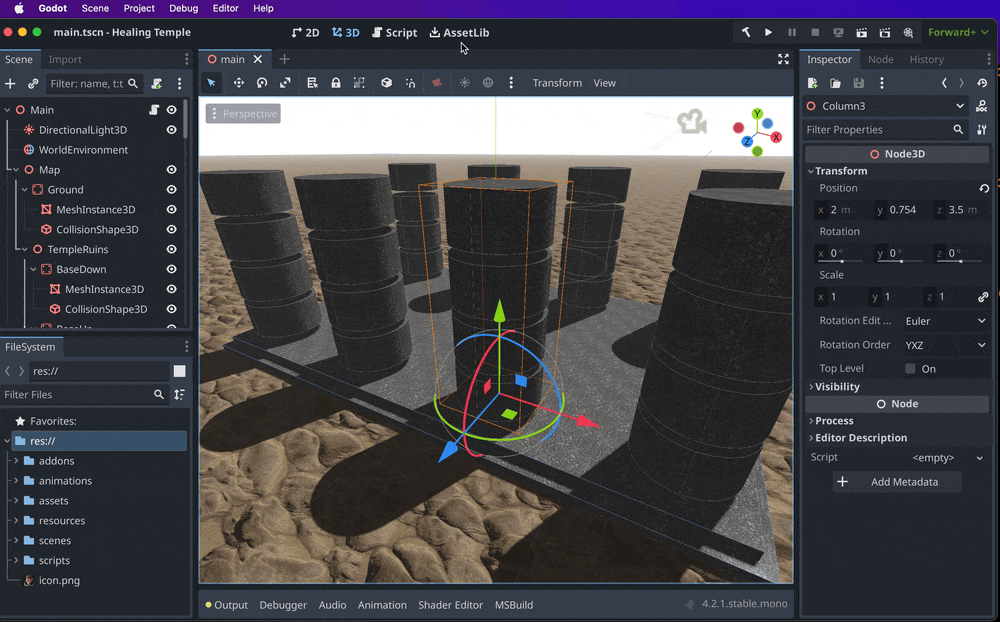

# Arcweave Godot Example

## Table of Contents

- Arcweave Godot Example
	- [Introduction](#introduction)
	- [The Godot Project](#godot-project)
		- [Importing & Building the Godot Project](#importing-building-godot)
		- [Brief Exploration of the Godot Project](#exploration-godot)
			- [Art credits](#art-credits)
			- [Scenes](#scenes)
			- [Scripts](#scripts)
			- [ArcweaveAsset & ArcweaveNode](#arcweave-asset-node)
	- [The Arcweave Project](#arcweave-project)
		- [Recreating the Arcweave Project](#recreate)
		- [Exploring the Arcweave Project](#explore)
			- [Story Premise](#story)
			- [Gameplay & Mechanics](#aw-gameplay)
			- [Components](#components)
			- [Boards](#boards)
			- [Global Variables](#global-variables)
	- [Connecting the Two Projects](#connect)
		- [Fetching from JSON File](#json-connect)
		- [Fetching With WebAPI](#api-connect)
	- [Playing the Godot Project](#playing)
		- [Gameplay & Mechanics](#gameplay)
		- [Settings Menu](#settings-menu)
	- [Runtime Story Updates](#story-updates)
		- [How to Fetch Story Updates](#change-howto)
		- [Testing Different Story Versions](#testing-versions)
		- [Various Story Changes to Try](#various-changes)
			- [Changing Dialogue](#change-dialogue)
			- [Changing Healing Points](#change-healing)
			- [Changing Sprite Colors](#change-colors)
			- [Adding Inventory Items](#change-items)


---

## Introduction

This short 3D game uses the [Arcweave plugin for Godot](https://github.com/arcweave/arcweave-godot-plugin) and demonstrates important implementations like:

* dialogue handling:
	* simple text content window;
	* speaker avatar fetched from current elemenent's attached component;
	* option buttons;
* character attributes fetched from Arcweave components:
	* name;
	* sprite color;
	* health bar color;
* events triggered by changes in Arcweave global variables:
	* inventory item add/remove;
	* health bar update;
	* animation triggered.
* runtime story updates via web API:
	* editable API key & hash fields;
	* save key & hash button;
	* fetch button.

It is an official Arcweave example serving as inspiration and starting point for expansions and testing on the basis of the action/adventure style.

---

## The Godot Project {#godot-project}

### Importing & Building the Godot Project {#importing-building-godot}

> **Note**: the Arcweave Plugin requires the **.NET** version of **Godot Engine 4** which you can find [here](https://godotengine.org/).

Download the project from **Code > Download ZIP**, extract, and import it in Godot.

To enable the plugin, you first need to:

1. build: click on **Build Project** (the hammer icon at the left of the "Run Project" play icon, at the editor's top right). 
2. reload: go to **Project > Reload Current Project**.

Check that the Arcweave plugin is now enabled from **Project > Project Settings... > Plugins**. The **Status** checkbox must be ticked.



### Brief Exploration of the Godot Project {#exploration-godot}

#### Art credits {#art-credits}

Quick shout-out to the people and organisations behind the project's art:

* texture materials by [Brian from Free PBR](https://freepbr.com/);
* character portraits by [Vaggelis Manousakas](https://www.artstation.com/ramhak);
* 3D mannequin downloaded from [Mixamo](https://www.mixamo.com/).

#### Scenes

The game's main scene is `main.tscn`.


For the characters, it uses `player.tscn` and `npc.tscn`—which use `dummy.tscn` for their 3D mannequin and animations.

#### Scripts

The main scene has `main.gd` attached, which runs most of the game's functions, including the ones related to the dialogue and the plugin.

The `player.gd` script  and `npc.gd` provide simple functionalities for the characters.

#### ArcweaveAsset & ArcweaveNode {#arcweave-asset-node}

The main scene has an **ArcweaveNode** as a child, but its attached **ArcweaveAsset** is void.

Before playing the game, you must connect the Arcweave project and fetch its data into the ArcweaveAsset.

## The Arcweave Project {#arcweave-project}

### Recreating the Arcweave Project {#recreate}

This game is made to be connected with Arcweave's *Game Engine Example,* a template found in the **New Project** menu.

To recreate the *Game Engine Example:*

* go to **Arcweave > My Projects**;
* click the **New Project** button;
* choose **Game Engine Example**.


### Exploring the "Game Engine Example" {#explore}

#### Story Premise {#story}

When an ally gets heavily wounded, the player must bring her a potion from a nearby healer.

#### Gameplay & Mechanics {#aw-gameplay}

The player has 2 NPCs to talk to, Wanda (the wounded ally) and the healer. 

Game state is checked at the beginning of each dialogue, so that proper options be presented. 

Both taking the potion from the healer and giving it to Wanda is checked through the use of the `visits()` arcscript function. The `have_potion` boolean variable is also there to trigger an inventory-handling function in the game engine.

#### Components

The example project has 4 components:

* Characters:
	* Wanda
	* the healer
	* Drake (the player).
* Other:
	* Environment

Each character component has an `obj_id`. We use this to associate each NPC with their Arcweave component.

They also have a `Color` attribute, which sets the NPC sprite and health bar color.

The Environment component offers a couple of extra attributes regarding the game environment: `Time` and `Weather`.

#### Boards

The project has 3 boards:

* **Starting Board**: all dialogue begins here.
* **Wanda Dialogue**: the Wanda dialogue tree.
* **Healer Dialogue**: the Healer dialogue tree.

The Starting Board contains one starting element per NPC dialogue, with the respective component attached to it. These send the flow to the proper board, where the actual dialogue happens.

> Note: in the specific game, the game engine ignores the project's Starting Element.

#### Global Variables {#global-variables}

The project has 3 global variables:

* `healer_health`
* `wanda_health`
* `have_potion`

Each one has its obvious function:

* all variables of the structure `[obj_id]_health` are the health score of the character with the given `obj_id`. 
* all variables of the structure `have_[some_item]` as the item's state regarding player inventory: `true` if carried and `false` if not.

## Connecting the Two Projects {#connect}

There are 2 ways to fetch the data from Arcweave into our Godot project.

### Fetching from JSON File (All Arcweave Accounts) {#json-connect}

The first way is to export the JSON file for Godot—available to all Arcweave accounts.

In the Arcweave project:

1. go to the **Share & Export** menu;
2. click **Export**;
3. choose the **Engine** tab;
4. choose **Godot 4**;
5. click **Export**;
6. extract the saved ZIP file;
7. note the path to the contained JSON file.

In the Godot game:

1. set the [ArcweaveAsset's](#arcweave-asset-node) **Receive Method** to `File`;
2. set the **File Settings** to the path of your downloaded JSON file;
3. click **Initialize Arcweave Asset**.

If everything is correct, the Godot console will print *"Successfully refreshed from File!"*

> **Note**: the JSON file is no longer required after initializing the ArcweaveAsset. The JSON data is then transferred to the ArcweaveAsset.

### Fetching With WebAPI (Team Accounts) {#api-connect}

The second way is to fetch Arcweave data through web API—available to Team accounts only. This allows story updates with just the click of a button, during runtime, too.

To set web API fetching for a project, we need:

* **API token** of the project's owner (and Team account holder)
* **project hash** 

To get the API token—being the project's owner & Team account holder—in Arcweave:

1. from inside the project, click your profile picture on the top right;
2. choose **My Account**;
3. click **Show API Token**;
4. click the **Clipboard icon** to copy it to clipboard;

To get the project hash:

1. open the Arcweave project;
2. from its **url**, double-click the part that comes right after `/app/project/`, to select it;
3. copy it to clipboard—that's the hash!

In the Godot project:

1. set the [ArcweaveAsset's](#arcweave-asset-node) **Receive Method** to `WebAPI`;
2. paste the API token and hash in the respective fields under the **API Settings**;
3. click **Initialize Arcweave Asset**.

If everything is correct, the Godot console will print *"Successfully refreshed from API!"*

### Arcweave Data in ArcweaveAsset Dictionary

The ArcweaveAsset now contains the Arcweave project's data as a Dictionary. Click on **Project Settings**: [Dictionary (size 14)] to explore them. Everything included in the Arcweave JSON is now loaded on the ArcweaveAsset.


## Playing the Godot Project {#playing}

### Gameplay & Mechanics {#gameplay}

The game is a very simplistic 3rd-person action RPG. The player can walk, run, and jump around a minimal setting, which includes a surreal ancient temple and 2 NPCs (Wanda and the Healer).

Whenever the player approaches an NPC, they see their **name** and **health bar**—the plugin's functions return information regarding the NPC's component name and their `_health` variable.

Talking to the NPC displays their **portrait**, **dialogue line**, and the player's **option buttons**, if any. The dialogue process triggers more functions of the Arcweave plugin, which return **element content** and the **speaker component** for each line of dialogue.

When the healer gives the player the potion, the item appears in the **inventory panel**, disappearing when Wanda drinks it.

### Settings Menu {#settings-menu}


#### Player Controls

| Action       | Player Input |
|:-----------------|:-----------------|
| RUN | Arrow Keys / WASD Keys |
| WALK | SHIFT + RUN |
| JUMP | SPACE / ENTER |
| TALK | SPACE / ENTER / LEFT MOUSE CLICK |
| CAMERA PAN | LEFT / RIGHT MOUSE MOVEMENT |
| SETTINGS ON / OFF | ESC |

#### Data Controls

To allow [runtime data fetching](#story-updates), the Settings menu features:

* Input field: **API Token**
* Input field: **Project Hash**
* Button: **Fetch Project Data**—fetches using the displayed API token and hash.
* Button: **Save API Token & Hash**—saves the preferred token & hash for automatic restoration with every game (re)start.

#### Game Controls

Finally, the Settings menu has the following obvious controls:

* Button: **Restart**
* Button: **Play**
* Button: **Quit**

By default, restarting the game also re-fetches the data using the saved keys. If no saved keys are found, the game uses the keys from the ArcweaveAsset's inspector.

To skip this automatic data re-fetching, comment out the call to `fetch_data_via_displayed_api()` in the `_ready()` method of the  `main.gd` script:

```
func _ready() -> void:
	...
	#fetch_data_via_displayed_api()
	...
```

## Runtime Story Updates {#story-updates}

The Arcweave plugin for Godot allows data fetching during game runtime, both from within the game engine editor and the exported game.

The Godot example is built to demonstrate this.

### How to Fetch Story Updates {#change-howto}

During gameplay:

* press the **ESC** key to bring forth the Settings menu;
* paste a different **API Token** and/or **Project Hash** in the respective input fields;
* click on the **Fetch Project Data** button;
* optionally, click **Restart**—probably a wise choice.

### Testing Different Story Versions {#testing-versions}

A useful case of such a functionality is when you have 2 or more Arcweave projects for the same story and want to swap from one to the other. Just swap their hash codes and you can then play the other version, without leaving your game.

The Settings menu displays the name of the fetched Arcweave project, so—as long as you name your versions accordingly—you know exactly what you are testing.

### Various Story Changes to Try {#various-changes}

Here are some examples of ways you can influence your Godot game by changing Arcweave parameters. All of the following examples will work without extra coding in the Godot game. Simply edit your Arcweave project and then fetch from the Godot game.

#### Dialogue Changes {#change-dialogue}

The obvious thing you can do is change the dialogue. Any content change or conditionals will be reflected in the Godot game's dialogue.

#### Changing Healing Points {#change-healing}


Change the points added to `wanda_health`, to change the healing potion's strength.

#### Changing Sprite Colors {#change-colors}

Change the value of the `Color` attribute in any of the characters.


You can use any of the standard HTML color names (case-insensitive, spaces allowed).


#### Adding Inventory Items {#change-items}

There is an extra item image included among the game assets: a scroll. You can find it in the **FileSystem** at `../assets/items_icons/scroll.png`


The `handle_variable_changes()` function of `main.gd` calls the `GetVariableChanges()` method of the **Story** class and then checks whether the changed variable has the `have_` suffix—like the existing `have_potion` of our Arcweave project.

This means that you can easily add a scroll to your game by adding a `have_scroll` global variable to your Arcweave project and inserting the assignment `have_scroll = true` anywhere in the story.


---

More in depth analysis of the game's `main.gd` script to be added...